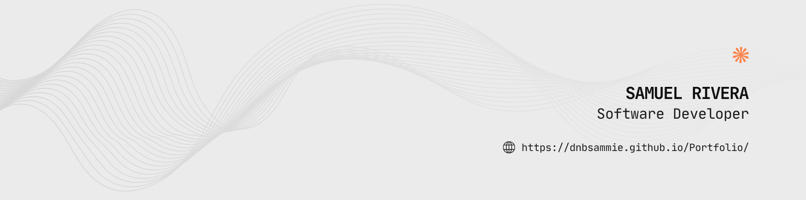

<h1 align="center">👋🏽 What's Up?</h1>
</img>

<h2 align="left">🤔 What About Me?</h2>

What's up? Welcome to my GitHub profile. I'm currently a software engineering student and I work with OOP languages like Java, C++ or C#. Apart from coding, my hobbies and passions are music, cars and video games, my personal projects start from ideas rooted in these. I am always looking for new opportunities to learn and grow professionally. Here you can find some of my most outstanding projects.

  

<h3>Technologies & Tools 🔧</h3>

  

<h3>My Github Stats 📈</h3>

<h2>Projects 🗃</h2>

<h3 align="left">Get in Touch 📱</h3>

