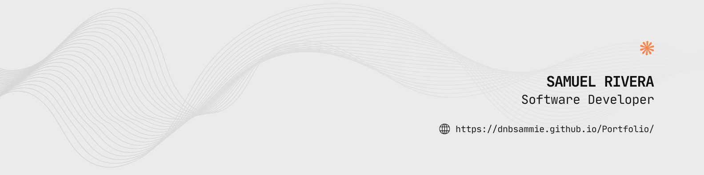

<h1>👋🏽 Hi, I'm Samuel</h1>

</img>
 
<h2>🧠 About me</h2>

Welcome to my GitHub profile! I'm a <b>software developer</b> with a strong interest in web development, understanding how and why things work. Here you can find some of my most notable projects.

Feel free to take a look at my <a href="https://dnbsammie.github.io/portfolio/" target="_blank">portfolio</a>.

<h2>🛠️ Languages, Technologies & Tools</h2>
 

  

<h2>🧪 What I'm working on?</h2>
 
<ul>
  <li>Learning and designing shaders and layouts with GLSL and ThreeJS</li>
  <li>I am improving my logic and development skills with Java.</li>
  <li>I aim to connect design and logic, building web solutions that feel seamless, practical, and visually appealing.</li>
</ul>

<h2>📊 My Github Stats</h2>
 

  
  

## 🎯 Future Goals
- Learn more about <strong>Java and Rust</strong>
- Develop open source projects
- Create and design user-friendly and functional software solutions

Thank you for visiting my profile. I hope you enjoy the projects I've shared!